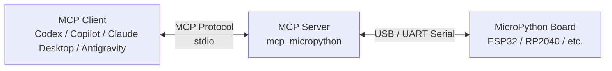

# MicroPython MCP Bridge — Design Document

## Overview

Build a bridge server that lets MCP clients (Claude Desktop and others) execute Python code,
manipulate files, and control the device against a MicroPython REPL (ESP32, RP2040, etc.).

---

## System architecture



---

## Component design

### 1. MCP Server layer (`server.py`)

- **Protocol**: uses MCP's `stdio` transport (the standard for connecting to Claude Desktop)
- **Library**: the `mcp` Python SDK (`pip install mcp`)
- **Responsibilities**: MCP tool definitions, accepting requests, returning responses

### 2. Serial Manager layer (`serial_manager.py`)

- **Library**: `pyserial`
- **Responsibilities**: managing serial communication with the MicroPython board
  - REPL control (`Ctrl+C` to cancel, `Ctrl+D` to reset)
  - Reliable code transmission using Raw REPL mode (`Ctrl+A`)
  - Receiving responses with a timeout
  - Connection management (automatic reconnection)

### 3. Tool definitions (`tools/`)

Each MCP tool is organized into modules by function.

---

## Static resource policy

- `micropython://guide/recipes`: how to carry out common tasks
- `micropython://policy/hardware-docs`: when `HARDWARE.md` should be updated
- `micropython://guide/troubleshooting`: recovery steps for common problems
- `micropython://guide/limitations`: list of known limitations

The criterion for updating `HARDWARE.md` is not "was a library added" but "has board-specific
knowledge that future sessions should reuse increased".

---

## MCP tool list (functionality provided)

| Tool name | Description | Main parameters |
|---|---|---|
| `micropython_exec` | Run Python code, blocking, and return the result | `code: str`, `timeout: int` |
| `micropython_eval` | Evaluate an expression and return its value | `expression: str` |
| `micropython_list_files` | List files on the filesystem | `path: str = "/"` |
| `micropython_stat_path` | Read information about a path | `path: str` |
| `micropython_read_file` | Read the contents of a file | `path: str`, `as_base64: bool = False` |
| `micropython_read_hardware_md` | Read `/HARDWARE.md` | none |
| `micropython_write_file` | Write content to a file | `path: str`, `content: str | None`, `content_base64: str | None` |
| `micropython_append_file` | Append content to a file | `path: str`, `content: str | None`, `content_base64: str | None` |
| `micropython_delete_file` | Delete a file | `path: str` |
| `micropython_make_dir` | Create a directory | `path: str`, `parents: bool = False`, `exist_ok: bool = False` |
| `micropython_remove_dir` | Remove an empty directory | `path: str` |
| `micropython_rename_path` | Rename a path | `src: str`, `dst: str` |
| `micropython_reset` | Soft reset (`machine.reset()`) | none |
| `micropython_get_info` | Get device information (chip info, free memory, etc.) | none |
| `micropython_list_ports` | List the available serial ports | none |
| `micropython_connect` | Connect to the given port | `port: str`, `baudrate: int = 115200` |
| `micropython_disconnect` | Close the serial connection | none |

---

## Details of the MicroPython communication protocol

The MicroPython REPL has the following two modes:

### Normal REPL
- Interactive input mode
- Prompt: `>>> `
- Used for simple commands

### Raw REPL (recommended)
- Enter with `Ctrl+A` (`\x01`)
- Return to the normal REPL with `Ctrl+B` (`\x02`)
- Transmission format:
  ```
  Ctrl+A  →  the board returns "raw REPL; CTRL-B to exit\r\n>"
  <code>  →  send the code
  Ctrl+D  →  execution trigger
  the board returns "OK<stdout>\x04<stderr>\x04>"
  ```
- **Ideal for automated processing, because a structured response can be obtained**

---

## Directory layout

```
0079_MCP/
├── design.md                  # this file
├── README.md
├── pyproject.toml             # package definition (uv)
├── src/
│   └── mcp_micropython/
│       ├── __init__.py
│       ├── server.py          # MCP server entry point
│       ├── serial_manager.py  # serial communication management
│       ├── raw_repl.py        # Raw REPL protocol implementation
│       └── tools/
│           ├── __init__.py
│           ├── execution.py   # exec/eval tools
│           ├── filesystem.py  # file manipulation tools
│           └── device.py      # device information and connection management tools
└── claude_desktop_config_example.json   # Claude Desktop configuration example
```

---

## Confirmed requirements (from stakeholder interviews)

| Item | Decision |
|---|---|
| MCP clients | Codex (VSCode), Copilot (VSCode), Antigravity |
| Connection method | USB serial only (WebREPL not required) |
| Execution environment | Windows PowerShell |
| Package management | `uv` |
| Large file transfer | Not required at this time (design with future extension in mind) |

---

## Technology stack

| Element | Technology chosen | Rationale |
|---|---|---|
| Language | Python 3.11+ | The environment recommended by the MCP SDK |
| MCP SDK | `mcp[cli]` | The official SDK |
| Serial communication | `pyserial` | A proven, standard library |
| Package management | `uv` | Fast, modern, and works on Windows |
| Transport | `stdio` | The standard for VSCode-extension-style MCP clients |

---

## Implementation phases

### Phase 1: Foundation (serial communication)
- [x] `serial_manager.py`: port discovery, connect, disconnect
- [x] `raw_repl.py`: sending and receiving code in Raw REPL mode
- [ ] Unit tests (verifiable with mocks, without real hardware)

### Phase 2: MCP server skeleton
- [x] `server.py`: starting the MCP server and registering tools
- [x] `micropython_connect` / `micropython_disconnect` / `micropython_list_ports` tools
- [x] Connection verified with Claude Desktop

### Phase 3: Execution tools
- [x] `micropython_exec`: run a block of code
- [x] `micropython_eval`: evaluate an expression
- [x] `micropython_get_info`: get device information

### Phase 4: Filesystem tools
- [x] `micropython_list_files` / `micropython_stat_path`
- [x] `micropython_read_file` / `micropython_read_hardware_md` / `micropython_write_file` / `micropython_append_file` / `micropython_delete_file`
- [x] `micropython_make_dir` / `micropython_remove_dir` / `micropython_rename_path`

### Phase 5: Quality and UX
- [ ] Stronger timeout and error handling
- [ ] Automatic reconnection
- [x] Documentation

---

## Considerations and risks

| Item | Details |
|---|---|
| Character encoding | Responses from the MicroPython board are UTF-8, but binary files need separate handling |
| Large file transfer | `write_file` sends multiple chunks internally |
| Concurrent access | Mutual exclusion on the serial link when multiple simultaneous requests arrive from the MCP client |
| Pinning the port | COM port names change depending on the OS, so make them specifiable in a configuration file |
| Raw REPL stability | The REPL can end up in a broken state on a communication error → a reset mechanism is needed |

---

## Reference links

- [MCP Python SDK](https://github.com/modelcontextprotocol/python-sdk)
- [MicroPython Raw REPL specification](https://docs.micropython.org/en/latest/reference/repl.html#raw-mode)
- [pyserial docs](https://pyserial.readthedocs.io/)
- [mpremote source code](https://github.com/micropython/micropython/tree/master/tools/mpremote) (reference for the Raw REPL implementation)
